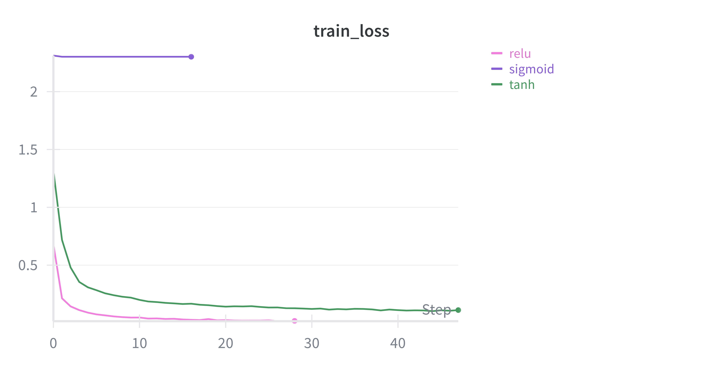
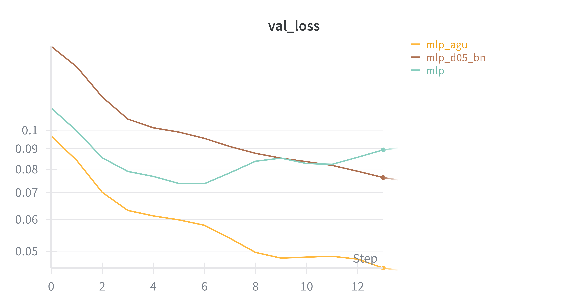

# deep_learning_application

Laboratory repository for the Deep Learning Applications course, featuring hands-on experiments across Computer Vision, Natural Language Processing, and Adversarial Machine Learning domains.

## :test_tube: Lab1 - Convolutional Neural Networks
The first laboratory studies MLP degradation patterns and vanishing gradients across different activation functions and regularization techniques. It then compares standard CNNs against versions with skip connections, demonstrating how residual connections solve the degradation problem. Finally, Grad-CAM analysis is applied to the best model on both clean and adversarially perturbed images to reveal attention pattern changes under attack conditions.
> **Experimental Results**: All experiments and training metrics are tracked and visualized at: [wandb](https://wandb.ai/martina-buccioni98-unifi/deep-learning-application?nw=nwusermartinabuccioni98)

Let's break the ice with MLP 

Among all the experiments conducted to study MLPs, two caught my attention. The first one focuses on the vanishing gradient problem in MLPs (to be fair, without any type of regularization). The second one, instead, focuses on normalizations.

<em>Left: Training loss comparison across activation functions | Right: Validation loss for different regularization strategies</em>

## :test_tube: Lab3 - Transformers and NLP

## :test_tube: Lab4 - Adversarial Learning and Out Of Distribution

