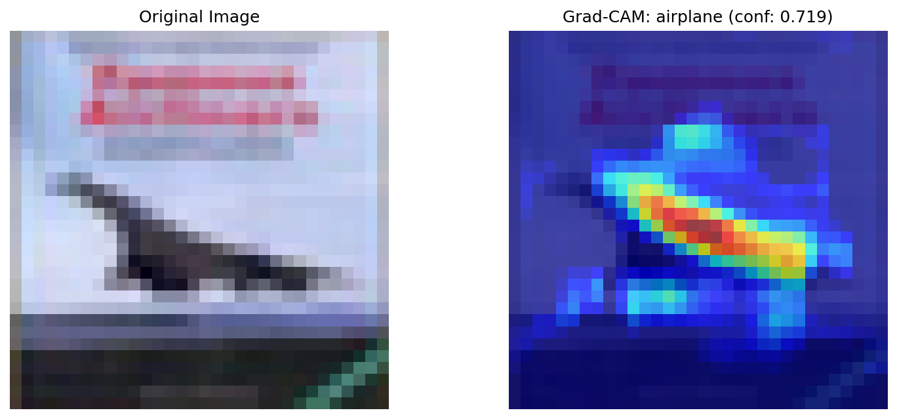
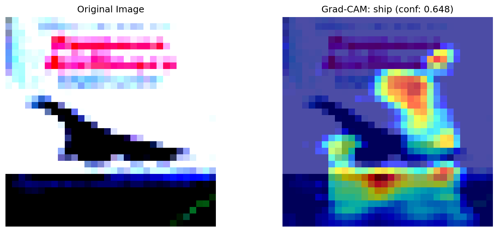
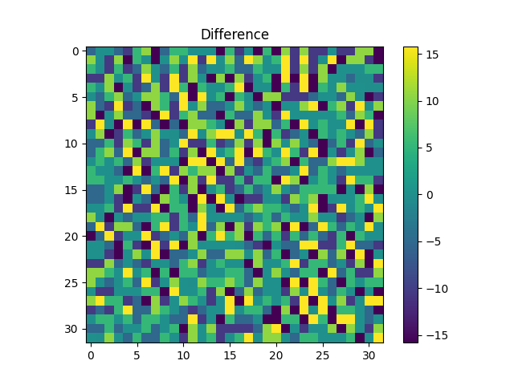
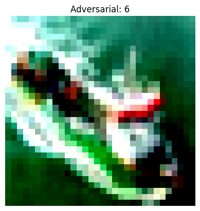
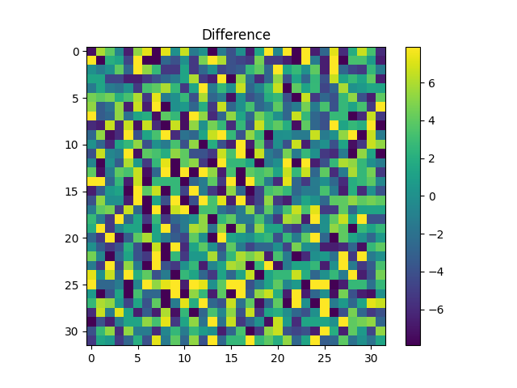
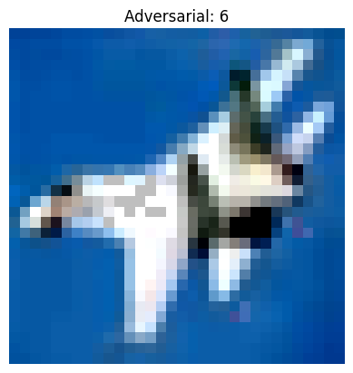
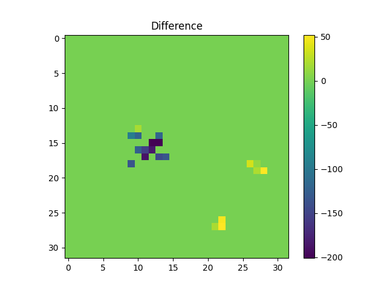
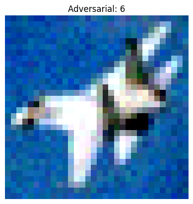
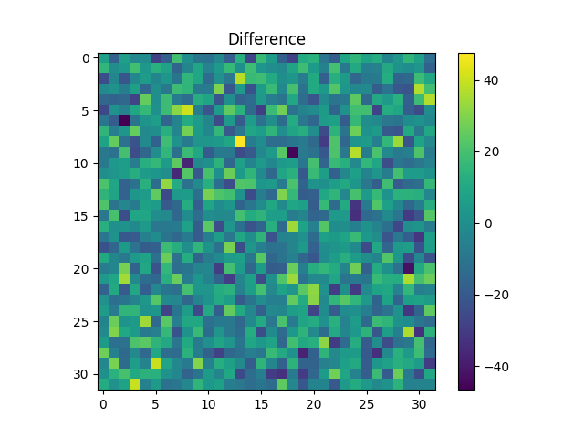

# deep_learning_application

Laboratory repository for the Deep Learning Applications course, featuring hands-on experiments across Computer Vision, Natural Language Processing, and Adversarial Machine Learning domains.

## :test_tube: Lab1 - Convolutional Neural Networks
The first laboratory studies MLP degradation patterns and vanishing gradients across different activation functions and regularization techniques. It then compares standard CNNs against versions with skip connections, demonstrating how residual connections solve the degradation problem. Finally, Grad-CAM analysis is applied to the best model on both clean and adversarially perturbed images to reveal attention pattern changes under attack conditions.
> **Experimental Results**: All experiments and training metrics are tracked and visualized at: [wandb](https://wandb.ai/martina-buccioni98-unifi/deep-learning-application?nw=nwusermartinabuccioni98)

Let's break the ice with MLP 

Among all the experiments conducted to study MLPs, two caught my attention. The first one focuses on the vanishing gradient problem in MLPs (to be fair, without any type of regularization). The second one, instead, focuses on normalizations.

<em>Left: Training loss comparison across activation functions | Right: Validation loss for different regularization strategies</em>

As shown in the left plot, the combination of saturating activation functions (sigmoid, tanh) and deep network architectures creates a multiplicative effect, causing gradients to diminish exponentially with each layer. This explains why early layers struggle to receive meaningful updates, resulting in slower or stalled training.

The right plot illustrates the impact of different regularization strategies. These results highlight that data augmentation can act as a powerful form of regularization, often outperforming architectural modifications in improving validation performance.
> **Dataset Augmentation in Feature Space**
> Terrance DeVries, Graham W. Taylor, ICLR 2017

To skip or not to skip - CNN  

<em>Learning curves</em>

| Architecture | Size | Depth | Final Accuracy | 
|--------------|------|-------|----------------|
| CNN | Small | [2,2] | 68% |
| CNN | Medium | [5,5] | 77% | 
| CNN | Large | [7,7] | 75% | 
| CNN + skip | Small | [2,2] | 63% | 
| CNN + skip | Medium | [5,5] | 79% | 
| CNN + skip | Large | [7,7] | **82%** | 

These results confirm the fundamental insight from ResNet - that skip connections solve the degradation problem by allowing gradients to flow directly through identity mappings, enabling effective training of very deep networks.

Gradcam: what does my best model sees? 

Grad-CAM (Gradient-weighted Class Activation Mapping) analysis was applied to the best-performing CNN to understand what regions the model focuses on for classification decisions. We want to show how the attention focuses over adversarial examples.

The analysis reveals how adversarial perturbations dramatically alter the model's attention patterns. In the original images, the model focuses on semantically relevant features; however, under adversarial attacks, attention either scatters to irrelevant regions or concentrates on attack-induced artifacts.
This phenomenon is clearly illustrated in other two cool examples, namely image 1 and image 7.

## :test_tube: Lab3 - Transformers and NLP

## :test_tube: Lab4 - Adversarial Learning and Out Of Distribution
This laboratory explores model security and robustness through three sequential investigations. First, we implement various adversarial attack methods - FGSM (Fast Gradient Sign Method), PGD (Projected Gradient Descent), one-pixel attacks, and genetic algorithm-based perturbations.
Second, we investigate out-of-distribution (OOD) detection capabilities by comparing two approaches: reconstruction-based detection using autoencoders versus confidence-based detection with CNNs. Finally, we enhance model robustness through adversarial training, incorporating adversarial examples generated from our attack methods into the training process. This demonstrates how exposure to adversarial samples during training can significantly improve model resilience against future attacks.

Let's hack it : adversarial attacks

- FGSM : 

<em>Left: FGSM distributed perturbations | Right: FGSM difference patterns</em>

- PGD : 

<em>Left: PGD distributed perturbations | Right: PGD difference patterns</em>

- Few-Pixel attack  : 

<em>Left: Few_pixel distributed perturbations | Right: Few-pixwl difference patterns</em>

- Genetic attack  : 

<em>Left: Genetic distributed perturbations | Right: Genetic difference patterns</em>

